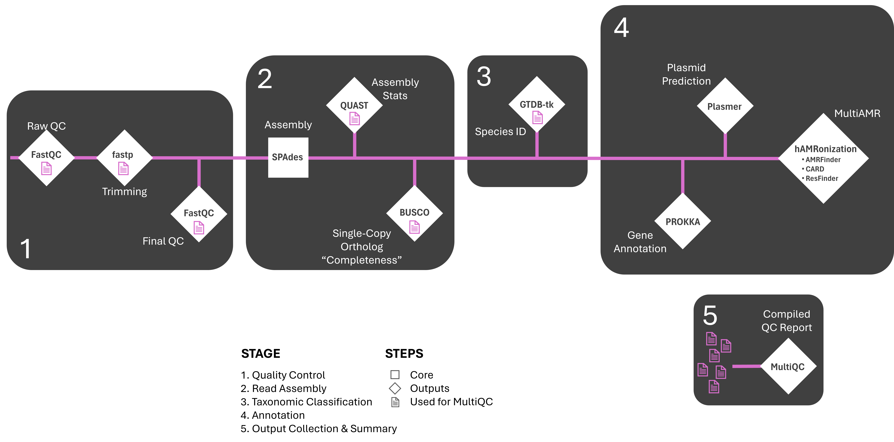

<a name="readme-top"></a>

<!-- PROJECT SHIELDS -->
[![Contributors][contributors-shield]][contributors-url]
[![Forks][forks-shield]][forks-url]
[![Stargazers][stars-shield]][stars-url]
[![Issues][issues-shield]][issues-url]
[![MIT License][license-shield]][license-url]
<!--[![MIT License][(https://img.shields.io/badge/style-flat--squared-green.svg?style=flat-square)]][license-url]-->
[](https://www.nextflow.io/)
[](https://www.docker.com/)
[](https://sylabs.io/docs/)
[
<!-- [![LinkedIn][linkedin-shield]][linkedin-url] -->

<!-- PROJECT LOGO -->
<br />

<h3 align="center">BALROG-ISO</h3>
  <p align="center">
    Bacterial Antimicrobial Resistance annOtation of Genomes - ISOlate whole genome

  <p align="center">
    <a href="https://github.com/edwardbirdlab/BALROG-ISO/issues/new?labels=bug&template=bug-report---.md">Report Bug</a>
    ·
    <a href="https://github.com/edwardbirdlab/BALROG-ISO/issues/new?labels=enhancement&template=feature-request---.md">Request Feature</a>
  </p>
</div>

<!-- Workflow Overview -->

<picture>
  <!-- Dark mode image -->
  <source media="(prefers-color-scheme: dark)" srcset="images/balrog_dark.png"> 
  <!-- Light mode image -->
  <source media="(prefers-color-scheme: light)" srcset="images/balrog_light.png">
  <!-- Fallback image -->
  
</picture>

<!-- ABOUT THE PROJECT -->


## About BALROG-ISO

<!-- [![Product Name Screen Shot][product-screenshot]](https://example.com) -->

BALROG-ISO (Bacterial Antimicrobial Resistance annOtation of Genomes - ISOlate whole genome) is a comprehensive high throughput Nextflow pipeline built to utilize next generaion short-reads for the investigation of bacterial antimicrobial resistance (AMR) and its mobility from whole genome sequences of bacterial isolates. While AMR characterization is the main goal of BALROG-ISO, it also provides the taxonomic classification, gene identities, and assignment of gene origin (i.e. plasmid or chromosome) for the submitted isolate(s). 

> [!NOTE]
> Updates to BALROG-ISO may occur periodically to help continually improve the pipeline. If you have any requests or recommended changes you'd like to see (i.e. usage with other data types), please reach out via email (edwardbirdlab@gmail.com | edwardbird@ksu.edu) or <a href="https://github.com/edwardbirdlab/BALROG-ISO/issues/new?labels=enhancement&template=feature-request---.md">request feature</a>.
> <br />
><br />
> If you experience any trouble or find bugs when running BALROG-ISO, please <a href="https://github.com/edwardbirdlab/BALROG-ISO/issues/new?labels=bug&template=bug-report---.md">report issues or bugs</a> and they will be addressed as soon as possible.

<h3 align="center">Not the BALROG pipeline you're looking for?</h3>
 <p align="center">
   <a href="https://github.com/edwardbirdlab/BALROG-MSR">BALROG-MSR: Bacterial Antimicrobial Resistance annOtation of Genomes - Metagenomic Short Read</a>
   <br />
   <a href="https://github.com/edwardbirdlab/BALROG-MON">BALROG-MON: Bacterial Antimicrobial Resistance annOtation of Genomes - Metagenomic Oxford Nanopore</a>

## Workflow Overview

<picture>

  <source media="(prefers-color-scheme: dark)" srcset="images/BALROG-ISOdarkmode.png"> 
  <source media="(prefers-color-scheme: light)" srcset="images/BALROG-ISOlightmode.png">
  
</picture>

*See sections below for details on subworkflows

<!--
<p align="right">(<a href="#readme-top">back to top</a>)</p>
-->

<!-- TABLE OF CONTENTS -->
## Table of Contents
- <a href="#readme-getting-started">Getting Started</a>
- <a href="#readme-running-balrog">Running BALROG-ISO</a>
- <a href="#readme-core-steps">Core Steps of Workflow</a>
- <a href="#readme-citations">Citations</a>
- <a href="#readme-license">License</a>
- <a href="#readme-contact">Contact Information</a>
<p align="right">(<a href="#readme-top">back to top</a>)</p>

<a name="readme-getting-started"></a>
<!-- GETTING STARTED -->
## Getting Started

Before you get too far along, familiarize yourself with this section to make sure this is the pipeline for you and your equipment and samples can meet the requirements. (Don't worry, there isn't too much to do).

### 1. What Data Do I Need?

BALROG-ISO in its current form expects Illuminia/Aviti paired-end, short-read data. BALROG-ISO in its standard configuration will require 100GB of RAM.
<br />
<br />
> [!NOTE]
>**If you would like to run BALROG-ISO with long-read data, feel free to <a href="https://github.com/edwardbirdlab/BALROG-ISO/issues/new?labels=enhancement&template=feature-request---.md">request feature</a>.**

### 2. Dependencies

All dependencies are managed via Docker Containers and hosted on DockerHub. In addion to Nextflow, one of the following container runtime software packages will be required:
<br />
- Nextflow (>= 23.04.0.5857) - [Install Nextflow](https://www.nextflow.io/docs/latest/install.html)
- Docker/Singularity/Apptainer - [Install Docker](https://docs.docker.com/engine/install/) - [Install Singularity](https://docs.sylabs.io/guides/3.0/user-guide/installation.html) - [Install Apptainer](https://apptainer.org/docs/admin/main/installation.html)

### 3. Installation

Preferred Method - Download Release
   ```sh
   wget https://github.com/edwardbirdlab/BALROG-MON/releases/download/v0.0.0/BALROG-0.0.0.tar.gz
   tar -xzf BALROG-0.0.0.tar.gz
   ```
Method 2 - Clone Repo
   ```sh
   git clone https://github.com/edwardbirdlab/BALROG-ISO
   ```

### 4. Creating a Sample Sheet

BALROG-ISO takes a CSV (Comma-Seperated-Value) sheet as the input. Note that the "sample" column will be the prefix of all output files for that sample. _This version does not automatically combine reads of the same sample name, so please combine sequencing runs manually before starting the pipeline._
<br />
<br />
Example Format:
```
sample,r1,r2
Sample_Name_1,/absolute/path/to/sample1_R1.fastq.gz,/absolute/path/to/sample1_R2.fastq.gz
Sample_Name_2,/absolute/path/to/sample2_R1.fastq.gz,/absolute/path/to/sample2_R2.fastq.gz
```

### 5. Nextflow Configuration

When creating a Nextflow config, ensure a container runtime is enabled (Singularity/Apptainer/Docker). If you are using Slurm, you can use the incuded Beocat Slurm config as a template. Most nf-core configs will also be supported. If you have never created a Nextflow config, or are having issues, reach out to your local administration.
<br />
[Nextflow Configuration](https://www.nextflow.io/docs/latest/config.html) - [nf-core configs](https://nf-co.re/configs)


### 6. Pipeline Configuration

If you want to change any parameters of BALROG-ISO from its default options, they can be changed using the "nextflow.config" file, or via command line. Configurable parameters will be outlined in the detailed sections below, as well as in the config file.

_Required Parameters_ <br />
   ```sh
  --samplesheet /path/to/samplesheet
  --run_name "NameOfRun"
   ```
<br />

_Optional Parameters_ <br />
   ```sh
  --sequencing_adapter_type illumina
   ```
         
>> Defines which adapter set to use. <br />
Default: illumina (options = illumina, aviti, custom) <br /> 


   ```sh
  --custom_sequencing_adapter_r1 "ATGCATGC"
   ```

>> Sequence of the read 1 adapter. <br />
Default: NaN <br /> 

   ```sh
  --custom_sequencing_adapter_r2 "ATGCATGC"
   ```

>> Sequence of the read 2 adapter. <br />
Default: NaN <br />

   ```sh
  --fastp_minlen 100
   ```

>> The minimum read length. <br />
Default: 100 <br />

   ```sh
  --fastp_q 20
   ```

>> The minimum q-score threshold. <br />
Default: 20 <br />

   ```sh
  --busco_lineage bacteria_odb10
   ```

>> Sets which BUSCO lineage to use. Recommend changing if you have an expected taxon. <br />
Default: bacteria_odb10 <br />

   ```sh
  --params.plasmer_min_len = 500
   ```

>> Sets the minimum sequence length to be included in plasmid prediction. _Not recommended to lower below 500._ <br />
Default = 500 <br />

  ```sh
  -- params.plasmer_max_len = 500000
  ```      

>> Sets the sequence length above which longer sequences are automatically predicted to be chromosomal in origin. <br />
Default = 500000 <br />

  ```sh
  --amrfinder_lineage Escherichia
  ```      

>> Enables species-specific models in AMRFinderPlus. See AMRFinder documentation for supported species and how to supply the name of them. <br />
Default: NaN <br />      


  ```sh
  --resfinder_lineage "Escherichia coli"
  ```    

>> Enables species-specific models in ResFinder. See ResFinder documentation for supported species and how to supply the name of them. <br />
Default: NaN <br />

<p align="right">(<a href="#readme-top">back to top</a>)</p>

<a name="readme-running-balrog"></a>
<!-- RUNNING BALROG-ISO -->
## Running BALROG-ISO

1. Running the Whole Pipeline
```sh
nextflow run /path/to/edwardbirdlab/BALROG-MON -c /path/to/config.cfg
```
2. Generate Multi-QC
```sh 
nextflow run /path/to/edwardbirdlab/BALROG-MON -c /path/to/config.cfg --workflow-opt multiqc
```
<p align="right">(<a href="#readme-top">back to top</a>)</p>

<a name="readme-core-steps"></a>
<!-- CORE STEPS OF WORKFLOW -->
## Core Steps of Workflow

### 1. Quality Control

_**Raw QC**_

- [FastQC](https://github.com/s-andrews/FastQC) : Raw Read

_**Human Read Removal Tool**_

- [sra-human-scrubber](https://github.com/ncbi/sra-human-scrubber) : Masks human sequences in data

_**Trimming**_

- [fastp](https://github.com/OpenGene/fastp)

_**Final QC**_
- [FastQC](https://github.com/s-andrews/FastQC) : Trimmed Read

### 2. Read Assembly

_**Genome Assembly**_

- [SPAdes](https://github.com/ablab/spades)

_**Assembly Stats**_

- [QUAST](https://github.com/ablab/quast) : Assembly Metrics Report

_**Genome Completeness**_

- [BUSCO](https://gitlab.com/ezlab/busco): Single-Copy Ortholog "Completeness"

### 3. Taxonomic Classification

- [GTDB-Tk](https://github.com/Ecogenomics/GTDBTk)

### 4. Annotation

_**Sequence Origin Assignment**_
- [Plasmer](https://github.com/nekokoe/Plasmer) : Plasmid prediction
    <br />

_**Functional Genome Annotation**_
- [Prokka](https://github.com/tseemann/prokka)

_**MultiAMR Resistance Gene Annotation**_
- [hAMRonization](https://github.com/pha4ge/hAMRonization) : Unified ARG Results Report from...
    <br />
          1) [CARD](https://card.mcmaster.ca/) using [RGI](https://github.com/arpcard/rgi)
    <br />
          2) [AMRFinderPlus](https://github.com/ncbi/amr)
    <br />
          3) [ResFinder](https://github.com/genomicepidemiology/resfinder)

### 5. Output Collection and Summary

- [MultiQC](https://github.com/MultiQC/MultiQC)
<p align="right">(<a href="#readme-top">back to top</a>)</p>

<a name="readme-citations"></a>
<!-- CITATIONS -->
## Citations

As there is currently no paper associated with BALROG-ISO, please cite this Github page. Also, I feel free to contact me (edwardbirdlab@gmail.com | edwardbird@ksu.edu) to let me know!

Many tools are used in this pipeline and its respective options. See 'CITATION.md' for the list of all tools used in this pipeline.

<!-- ROADMAP 
## Roadmap

- [ ] Feature 1
- [ ] Feature 2
- [ ] Feature 3
    - [ ] Nested Feature

See the [open issues](https://github.com/edwardbirdlab/BALROG-ISO/issues) for a full list of proposed features (and known issues).

<p align="right">(<a href="#readme-top">back to top</a>)</p>


-->
<p align="right">(<a href="#readme-top">back to top</a>)</p>

<a name="readme-license"></a>
<!-- LICENSE -->
## License

Distributed under the MIT License. See `LICENSE` for more information.


<p align="right">(<a href="#readme-top">back to top</a>)</p>

<a name="readme-contact"></a>
<!-- CONTACT -->
## Contact

Edward Bird -  - edwardbirdlab@gmail.com  |  edwardbird@ksu.edu

<p align="right">(<a href="#readme-top">back to top</a>)</p>

<!-- MARKDOWN LINKS & IMAGES -->
<!-- https://www.markdownguide.org/basic-syntax/#reference-style-links -->
[contributors-shield]: https://img.shields.io/github/contributors/edwardbirdlab/BALROG-ISO.svg?style=for-the-badge
[contributors-url]: https://github.com/edwardbirdlab/BALROG-ISO/graphs/contributors
[forks-shield]: https://img.shields.io/github/forks/edwardbirdlab/BALROG-ISO.svg?style=for-the-badge
[forks-url]: https://github.com/edwardbirdlab/BALROG-ISO/network/members
[stars-shield]: https://img.shields.io/github/stars/edwardbirdlab/BALROG-ISO.svg?style=for-the-badge
[stars-url]: https://github.com/edwardbirdlab/BALROG-ISO/stargazers
[issues-shield]: https://img.shields.io/github/issues/edwardbirdlab/BALROG-ISO.svg?style=for-the-badge
[issues-url]: https://github.com/edwardbirdlab/BALROG-ISO/issues
[license-shield]: https://img.shields.io/github/license/edwardbirdlab/BALROG-ISO.svg?style=for-the-badge
[license-url]: https://github.com/edwardbirdlab/BALROG-ISO/blob/master/LICENSE
[linkedin-shield]: https://img.shields.io/badge/-LinkedIn-black.svg?style=for-the-badge&logo=linkedin&colorB=555
[linkedin-url]: https://linkedin.com/in/linkedin_username
[Nextflow-url]: https://nextflow.io
[nextflow.io]: https://github.com/nextflow-io/nextflow/workflows/Nextflow%20CI/badge.svg
